# Project Report: Test 2 Image Generating Task 🎨🖼️

Author: Zhiyi Shi ([zhiyis](zhiyis@andrew.cmu.edu)), Linji Wang ([linjiw](linjiw@andrew.cmu.edu))

## Start with GigaGAN

<!-- # Introduction -->

Once upon a time, in our class, we were introduced to **GigaGAN**[^1] - a remarkable idea that instantly caught our attention. As we delved deeper into the topic, we were astounded by the intricate handling of the filter bank that was mentioned. Our curiosity was piqued, and we found ourselves deeply interested in the concept. Moreover, we were already drawn to the idea of text-to-image conversion and its potential applications. We felt compelled to explore the intricacies of Giga GAN further and decided to undertake a project to reproduce the code and learn more about its text-to-image processing techniques.


### Challenges in GigaGAN

However, after reading the entire paper, we realized the serious shortage of computing resources. (The smallest version of Giga GAN in the paper is trained on 64 A-100 GPU.) So, we plan to only create a "toy" version of Giga GAN to showcase its implementation ideas. After referring to the GitHub code to implement the forward part of the model, we decided to select some parts from the full model in the original paper for experimentation. In the end, we chose clip loss, matching aware loss, multi-scale loss, and filter bank.


We have written the code for these parts based on the paper. However, even if we use a very small batch size (which is 2), the model could only be trained on our GPU when incorporating the matching aware loss and clip loss. When multi-scale loss or filter bank is added, the GPU's memory is insufficient.

The dataset we use is a Pokemon dataset with text and images paired. This text will provide a simple description of the image, with key information including color, species, and action.

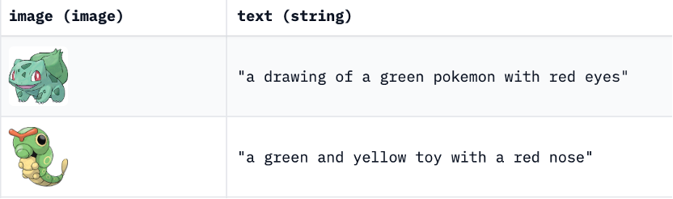

### Results in GigaGAN
In the beginning, we only added the most basic GAN loss without any condition to test the ability to generate clear images: that is, the model only pays attention to the authenticity of the generated images.  


It can be seen that the generated image still has a rough outline, although the details are not satisfactory. Also, it can be seen that the colors, contours, and patterns all have certain rules, and the generated images have diversity.

Then we tried to add a naïve text condition to observe the results:

  **drawing of a brown and black Pokemon**

It can be seen that the image quality has significantly decreased compared to not incorporating text conditions. It can be seen that the generated image roughly matches the content described in the text, but its shape is relatively strange. It means that the addition of text conditions significantly makes training more difficult to converge.

Then we added matching loss for training and observed the results. It can be seen that the colors described in the generated image and text can match, but the shape is relatively irregular, indicating that the training did not converge well.

  **drawing of a brown and black Pokemon with matching loss**


Then we added clip loss for training and observed the results. The generated images have no meaning, this is a completely non-convergent model. This indicates that our designed clip loss makes training extremely difficult to converge.

 **drawing of a brown and black Pokemon with clip loss**

Besides the visual differences, the quantitative results also show that the clip loss did not work in our case, and even produce worse results.

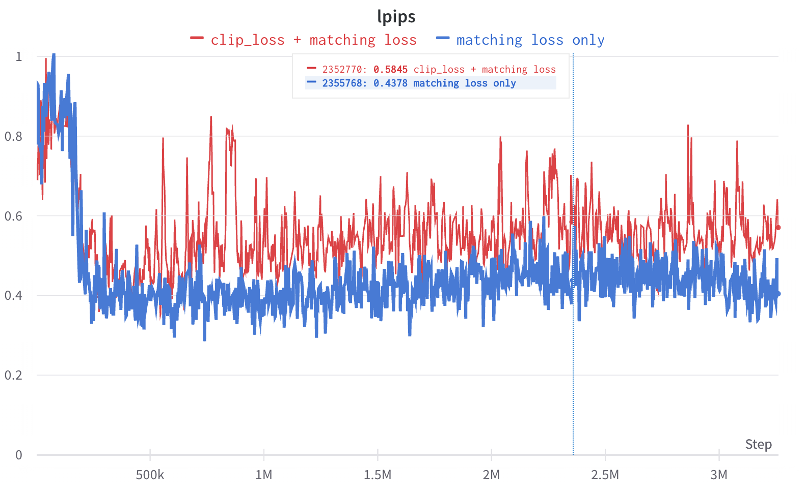

This experiment is done using [**Learned Perceptual Image Patch Similarity (LPIPS)**](https://github.com/richzhang/PerceptualSimilarity) for evaluate the simiarity in feature space.

### Conclusions in GigaGAN:

1.	The effect of the image we generated is not good, which may be related to the selection of a hyperparameter and the size of the data. Firstly, choosing a smaller batch size can result in poor convergence of the entire training. Secondly, there are too many hyperparameters in this model, and we can only use a few tuning parameters due to our computing resources.
2.	GANs, in general, require a substantial amount of computing resources for training and might be unstable when training on small datasets or with insufficient computational resources.

### Continue Explore Text 2 Image
Although the implementation effect of Giga GAN is not satisfactory, we are still quite interested in handling clip loss. Thus, we searched for relevant papers and open-source resources and decided to convert text to images again on the diffusion model, and compared its effectiveness with GAN.


## Switch to Imagen

In this project, we first attempted to reproduce and explore the GigaGAN model, uncovering its remarkable text-to-image processing techniques. Subsequently, we shifted our focus to the **MinImagen**[^2] architecture, an efficient text-to-image generation model capable of producing high-quality images. Our goal is to experiment with these two models, comparing their strengths and weaknesses, and ultimately share our findings and experiences in the world of image generation.

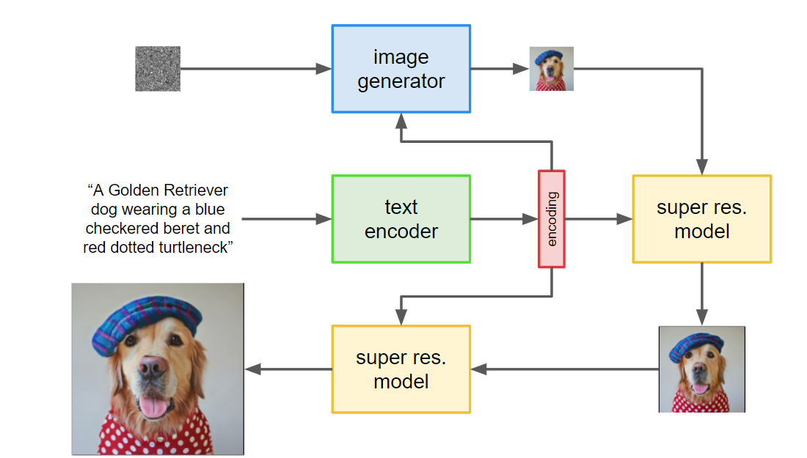


<!-- In this project, we aim to implement an **Image Generation** model based on the [**MinImagen**][1](https://github.com/AssemblyAI-Examples/MinImagen) architecture. MinImagen is a text-to-image generation model that is efficient and generates high-quality images from textual descriptions. Our goal is to experiment with this model and share our findings and experiences. -->

### Implementation

We began by implementing the **MinImagen** model using the resources provided by **AssemblyAI** [^3]. The key component of this implementation is the **Diffusion** part, which has the following characteristics compared with the **GigaGAN** in our training environment.:

- Training is fast ⚡
- Sample image generation is slow 🐢
- Convergence is fast 🏃
- Generated results are more meaningful 🎯

<!-- Another important feature of our implementation is the **classifier-free guidance** for text conditioning. This means that we don't need to rely on a separate classifier to guide the image generation process. -->

<!-- ### Dataset

We used the [**HuggingFace lambdalabs/pokemon-blip-captions dataset**](https://huggingface.co/datasets/lambdalabs/pokemon-blip-captions)🐾 as the basis for our image generation task. We edited the dataloader and dataset functions to make them compatible with our implementation.

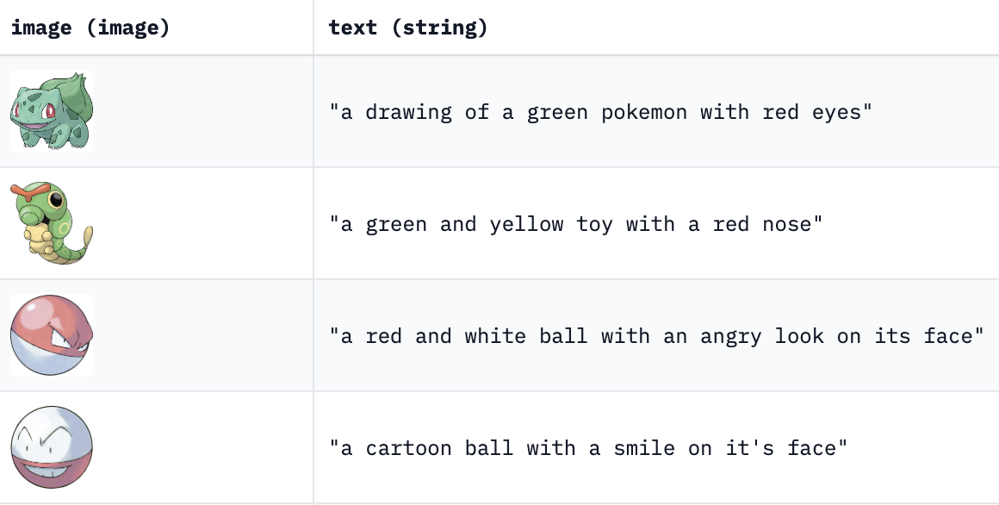 -->

### Experimentation

During the experimentation phase, we encountered some challenges:

1. **Model Size**: The original model with super resolution was too large to fit into a 12GB GPU for training, even with a batch size of 1.
2. **Logging**: We used **Weights & Biases (wandb)** for logging our training process.

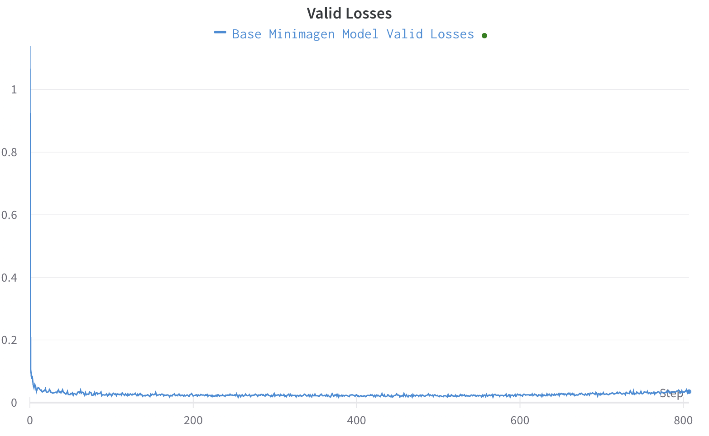

3. **Remove Super Resolution**: Due to the model's large size, we had to remove the super resolution layer for training.

```json
// Training parameters
{
    "text_embed_dim": null,
    "channels": 3,
    "timesteps": 1000,
    "cond_drop_prob": 0.15,
    "loss_type": "l2",
    "lowres_sample_noise_level": 0.2,
    "auto_normalize_img": true,
    "dynamic_thresholding_percentile": 0.9,
    "only_train_unet_number": null,
    "image_sizes": [
        64
    ],
    "text_encoder_name": "t5_small"
}
// Model Size
{
    "dim": 128,
    "dim_mults": [
        1,
        2,
        4
    ],
    "channels": 3,
    "channels_out": null,
    "cond_dim": null,
    "text_embed_dim": 512,
    "num_resnet_blocks": 1,
    "layer_attns": [
        false,
        true,
        true
    ],
    "layer_cross_attns": [
        false,
        true,
        true
    ],
    "attn_heads": 8,
    "lowres_cond": false,
    "memory_efficient": false,
    "attend_at_middle": false
}
```

Despite these challenges, our model was able to converge quickly, taking only 300 epochs with a batch size of 2 and a time step of 1000 to generate meaningful images. 🌟

| Training Step | Image |
|:-------------:|:-----:|
| a blue and red pokemon 500        | 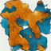 |
| a blue and red pokemon 600        | 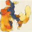 |
| a blue and red pokemon 700        | 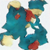 |
| a blue and red pokemon 800        | 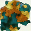 |

We think the quality of Imagen generated image is better than our previous results from GigaGAN, even in a very early training stage. One could think these images look more complete than the previous results, thus some extent more like a Pokemon.


| Text Prompt (text scale) | Image |
|:-------------:|:-----:|
| a drawing of a green pokemon with red eyes (0.1)        | 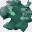 |
| a drawing of a green pokemon with red eyes (3.0)       | 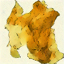 |
| a drawing of a green pokemon with red eyes (5.0)       | 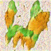 |

We could notice that with add more strength to the text scale, it starts to align with the text in some extent. Like when it is 0.1, it is just green. When add to 3.0, it shows a yellow color, which might be some blending information from "blue" and "red". When add to 5.0, it shows a blend with yellow and green, thus we assume it catchs more information from the content step by step.

When text scale = 5.0, we could notice that the image quality is not good and has a lot of noise on the white background. This is due to the text scale is too high that we force the network to focus more on the text information, but not the quality side.


<!-- <span style="color:blue">some *blue* text</span>. -->

### Future Work 💡

We plan to add a **super resolution layer** in the future to further improve our image generation capabilities.

### Conclusion

Our project on implementing and experimenting with the MinImagen architecture for text-to-image generation has been successful. We were able to generate meaningful images from textual descriptions, overcoming challenges related to model size and training resources. We hope that our experience and findings can help others working on similar projects. 😃


[^1]: GigaGAN (https://mingukkang.github.io/GigaGAN/)
[^2]: MinImagen: Build Your Own Imagen Text-to-Image Model (https://www.assemblyai.com/blog/minimagen-build-your-own-imagen-text-to-image-model/)
[^3]: AssemblyAI-Examples/MinImagen GitHub Repository (https://github.com/AssemblyAI-Examples/MinImagen?ref=assemblyai.com)
